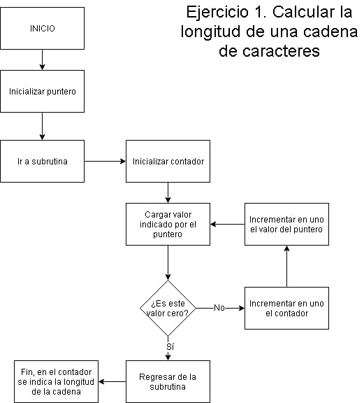
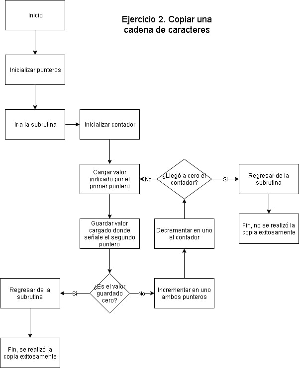
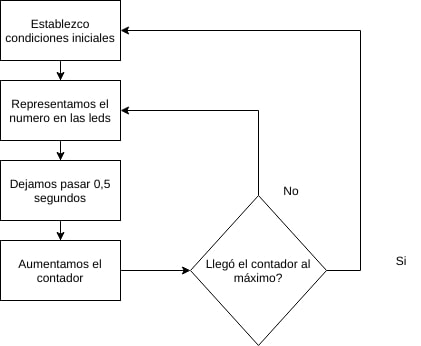
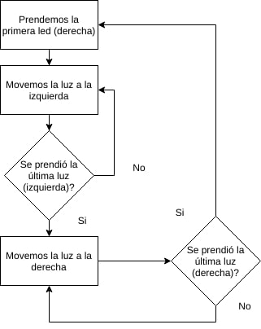
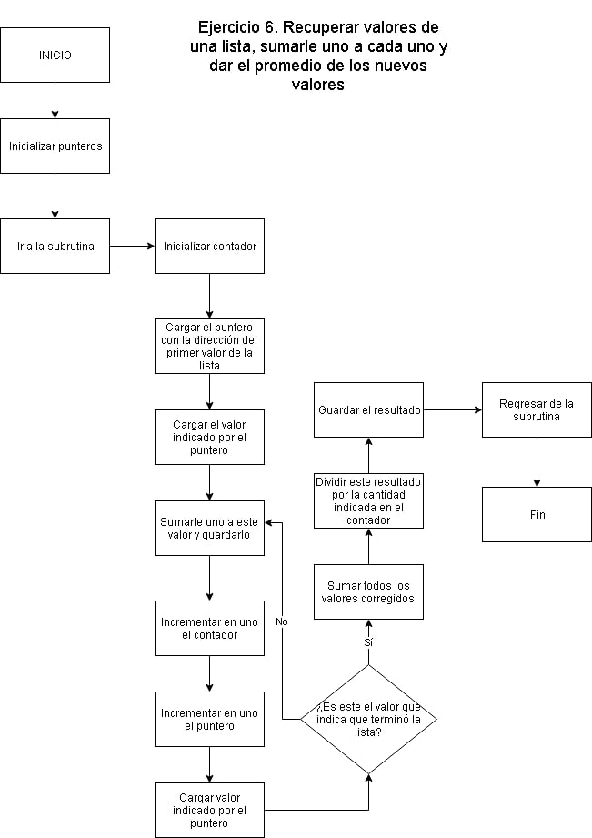

# TP 6

## String Length

Escribir una subrutina llamada sterlen (string length), la misma deberá calcular la longitud de una cadena (secuencia de caracteres) terminada en $00.  
La subrutina recibe como parámetro por el registro IX un puntero a la dirección de inicio de la cadena y devuelve en el registro A la longitud de la misma.  Usar  las  directivas  FCC  y  FCB  para  definir  la  cadena  de  prueba.

## String copy

Escribir  una  subrutina  llamada  strcpy  (string  copy),  la  misma  deberá  copiar  un  string  (cadena  de  caracteres)  que  se  encuentra  en  una  zona  de memoria origen a otra zona de memoria destino.  
La subrutina recibe como parámetro un puntero (dirección de memoria) a la dirección de inicio del string en el registro IX y la dirección destinto en el registro IY. Usar la directiva FCC y FCB para definir la cadena origen de prueba y RMB para reservar la zona de memoria destino (reservar por defecto 20 bytes). El string origen tiene como terminador el cero. La copia termina una vez copiado el terminador $00. Si la función puede realizar la copia exitosamente deberá colocar un cero en el registro A, de no hacerlo deberá setear el mismo con un uno.

## Binary counter

Utilizando  los  leds  que  el  wookie  tiene  conectados  al  puerto A  (la  dirección  del  puerto A  figura  en  la  hoja  de  datos  del  procesador) del  HC11 y teniendo en cuenta que solo los bits (3 al 6) del mismo son salidas.

## Average

Escribir la subrutina get_aver.
Esta subrutina recibe por stack una dirección de memoria que indica el comienzo de un conjunto de datos recopilados por un sensor de temperatura. El terminador de este conjunto de datos se indica por el byte $FF. El sensor tiene un pequeño error por lo que es necesario que  cada  dato  se  le  sume  1  para  corregir  lo  que  se  denomina  offset  de  calibración.  Cómo  no  se  puede  alterar  los  datos  originales.  Se pide  entonces  que  la  subrutina  “copie”  en  una  zona  de  memoria  temporal  del  stack  todos  los  valores  de  temperatura,  les  sume  uno  y devuelva el promedio de las temperaturas por stack (1 byte).

