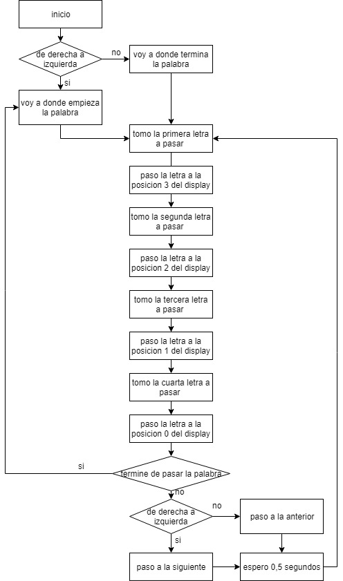

# Display

## Manejo de un display alfanumérico

El simulador del Wookie cuenta con un display alfanumérico. El mismo se puede pensar como un array de 4 elementos, donde cada elemento es un dígito. Los elementos se numeran del 0 al 3 comenzando desde la derecha (ver esquema).

| 3 | 2 | 1 | 0 |
|:-:|:-:|:-:|:-:|

Para el manejo del display la cátedra creo una serie de funciones. Por lo general cuando se maneja un periférico se crean librerías que contienen los drivers del periférico, las funciones que se encuentran a continuación podrían considerarse como partes de una librería de manejo de display.

Un periférico antes de comenzar a utilizarse debe inicializarse. El display cuenta con una rutina de inicialización initdis. Antes de utilizar el display, por primera vez, se deberá invocar a esta subrutina.

    initdis	equ	*
        
            psha
        
            ldaa #$FF       ;set for output
            staa DDRC       ;C output
            ldaa PIOC       ;get current value
            anda #$FE       ;reset bit 0 to 0
            staa PIOC       ;send it out
        
            pula
        
            rts
	
Una librería de manejo de periférico debe contar con funciones de entrada y salida. La cátedra les brinda la función outchar (output character), la misma se utiliza para enviar un carácter alfa numérico al display.
La función recibe en el registro A el carácter ASCII que se quiere mostrar en el display. El registro B debe contener la posición en la que se quiere colocar el carácter sobre el display (0 a 3).
A continuación se muestra el código de la función outchar.

	**************************************
	*Outchar: ACCA: Carácter a enviar
	*		ACCB: Posición (0-3)
	**************************************
	outchar	equ	*

			stab PORTCL     ;set the position 
			staa PORTB      ;set the character
	
			rts

Para que las funciones de la librería de manejo de display se puedan utilizar se deberán definir las siguientes contantes simbólicas en el código fuente.

    DDRC    equ $1007        ;data direction register for C
    PIOC    equ $1002        ;for strobe B assertion change
    PORTCL  equ $1005        ;port C latched
    PORTB   equ $1004        ;port B

## Definición del problema 

Se pide escribir las funciones necesarias para mostrar una frase en el display en forma secuencial (moviéndose de derecha a izquierda continuamente un carácter por vez). El intervalo de desplazamiento de cada carácter deberá estar comprendido entre 0,5 y 1 segundo (quedando a criterio del alumno el tiempo que mejore la visualización de la frase). Las frases deberán estar terminadas por el terminador cero.

Además de esto, el grupo deberá incluir en el código una constante simbólica (EQU) que al cambiarse de valor (ejemplo: pasar de 0 a 1) haga que la frase en del display se mueva en sentido  contrario (de izquierda a derecha). Obviamente será necesario volver a compilar el código para que los cambios tomen efecto. Esta condición se evaluará en la entrega del TP.

Es recomendable familizarse con las funciones del display antes de comenzar a programar el desplazamiento de frases, escribir un programa de prueba que consista en colocar una letra en distintas posiciones del display es una buena manera de empezar este trabajo práctico.

Importante:
- Documentar claramente el intervalo de tiempo elegido y el cálculo del mismo.
- Armar un esqueleto para el programa. Definir funciones y un diagrama de flujo antes de empezar a programar. Modularizar el desarrollo al máximo.
- Utilizar el stack en forma eficiente. 
- Es recomendable borrar el display antes de comenzar.
- Los mensajes deben definirse con las directivas FCC y FCB.
- Utilizar constantes simbólicas para clarificar el código.
- Seguir los criterios de buena programación.

## Diagrama

